# AOA-QL: Adaptive Arithmetic Optimization Algorithm using Q-Learning

This repository contains the implementation of the AOA-QL algorithm, a novel hybrid metaheuristic algorithm that enhances the standard Arithmetic Optimization Algorithm (AOA) by integrating a Q-learning mechanism.

## Objective

The primary goal of AOA-QL is to replace the static, iteration-dependent control parameters of AOA with a dynamic, adaptive strategy that learns the most effective search behavior based on the state of the optimization process.

## How to Run

1. **Clone the repository:**
   ```bash
   git clone https://github.com/your-username/AOA-QL.git
   cd AOA-QL
   ```

2. **Install the dependencies:**
   ```bash
   pip install -r requirements.txt
   ```

3. **Run the main script:**
   ```bash
   python main.py
   ```

This will run both the standard AOA and the AOA-QL algorithms and display a plot comparing their convergence curves.

## Benchmark Results

Here are the convergence curves for the 12 benchmark functions:

| F01 | F02 | F03 |
|---|---|---|
| 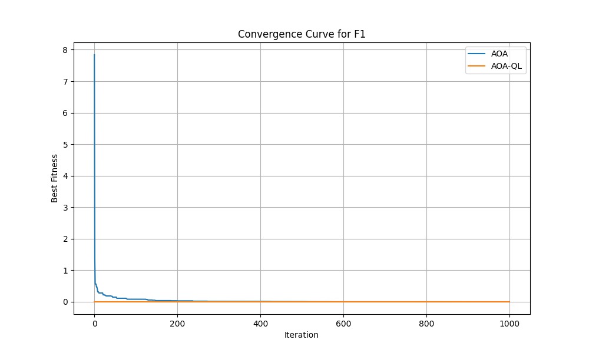 |  | 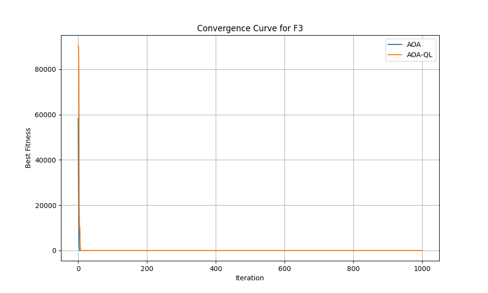 |

| F04 | F05 | F06 |
|---|---|---|
| 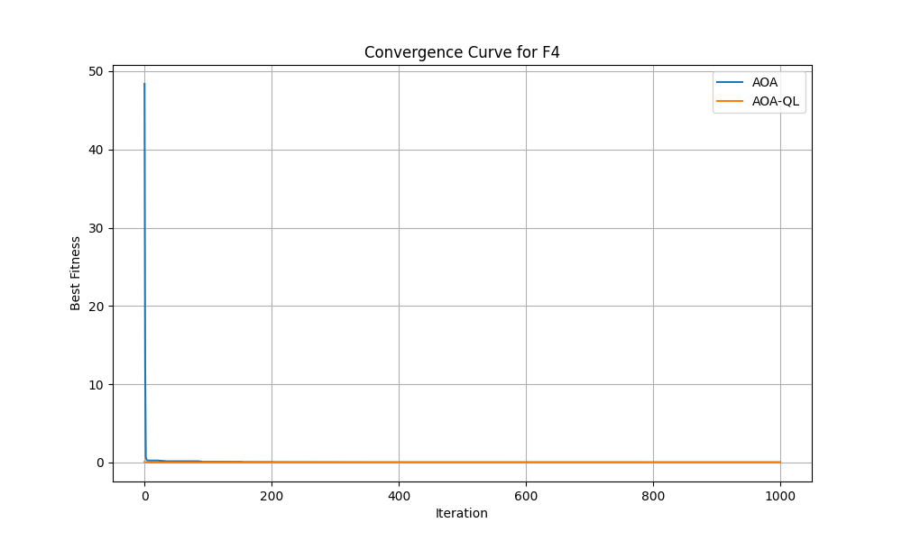 | 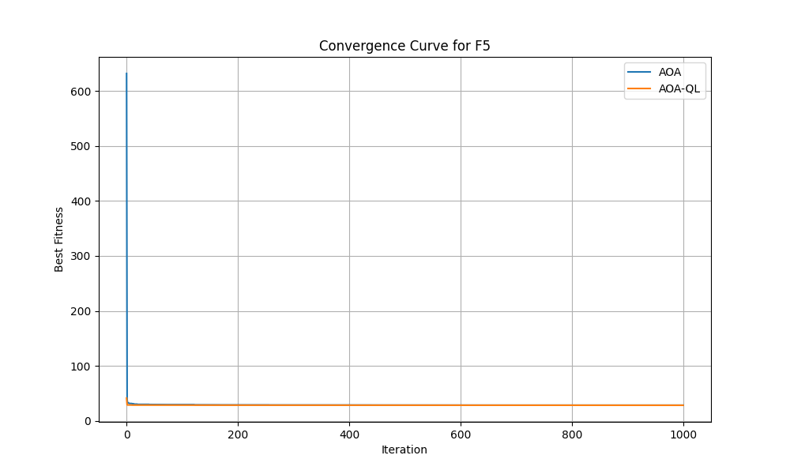 | 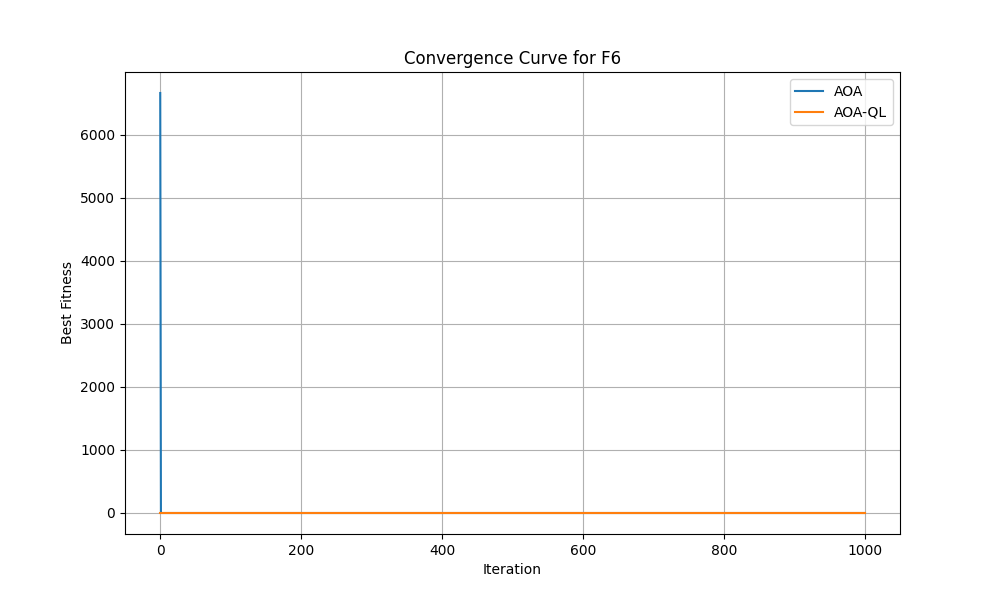 |

| F07 | F08 | F09 |
|---|---|---|
| 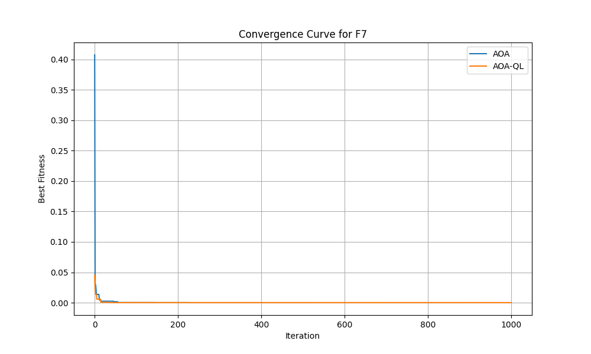 | 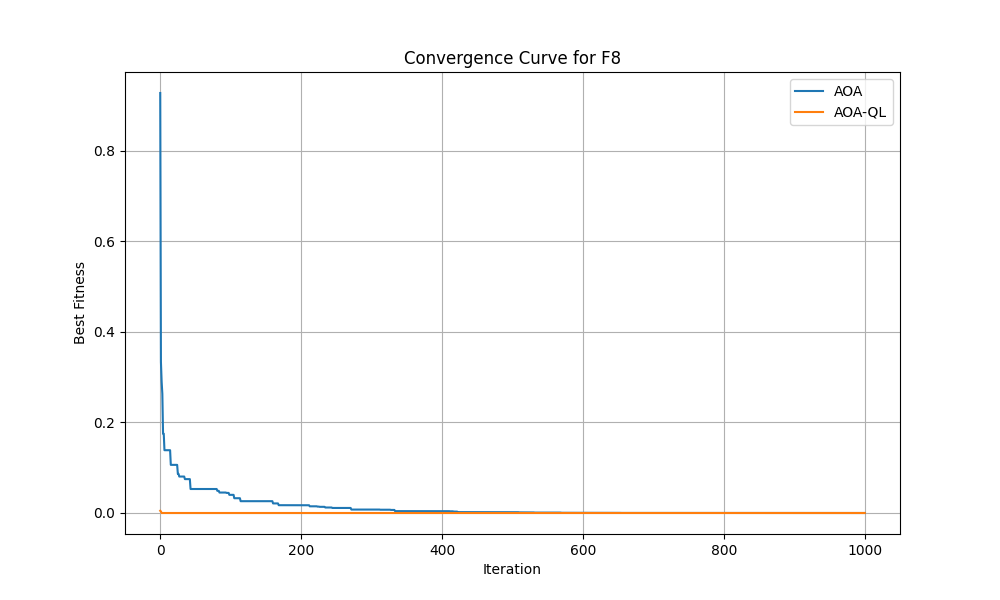 | 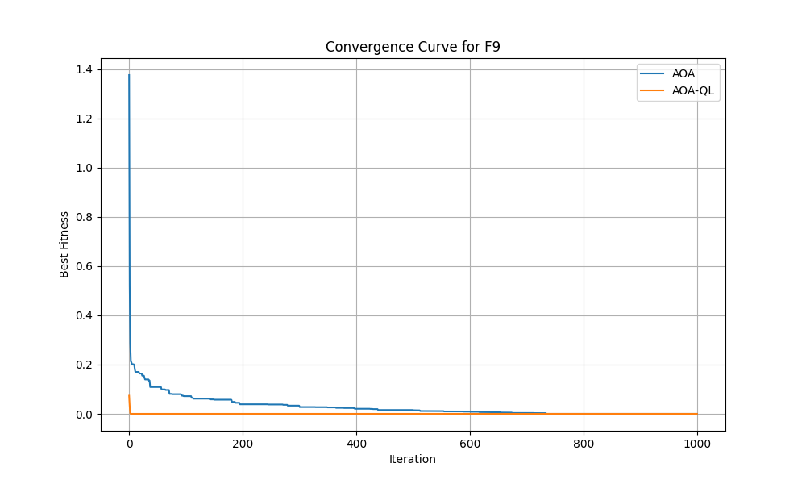 |

| F10 | F11 | F12 |
|---|---|---|
| 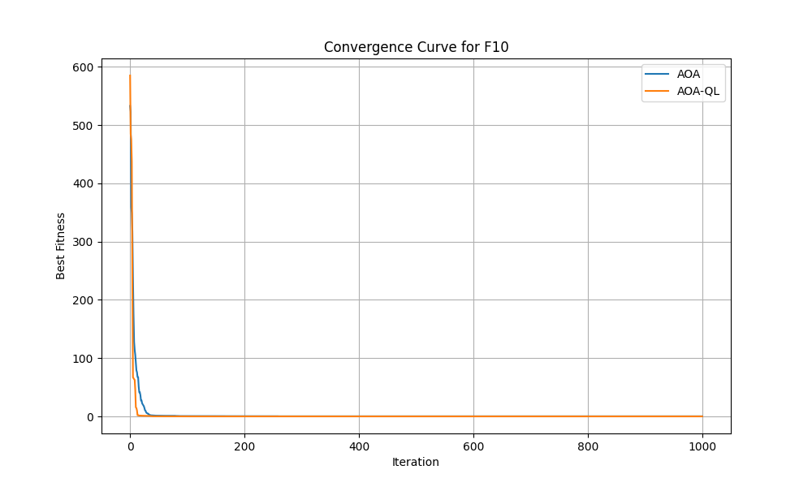 | 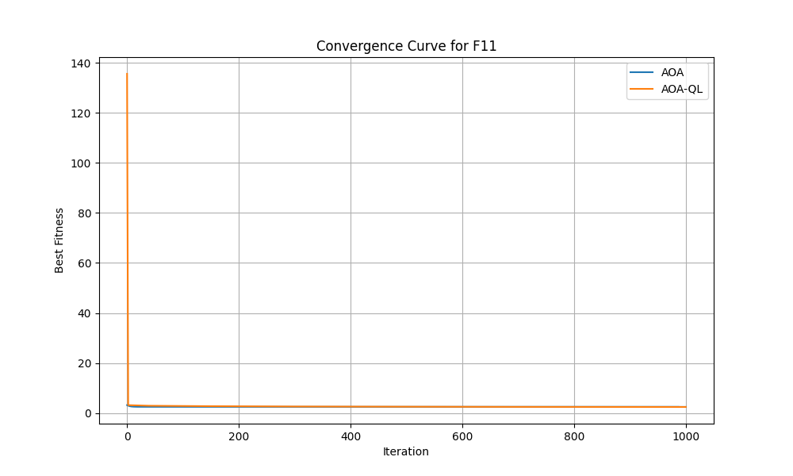 | 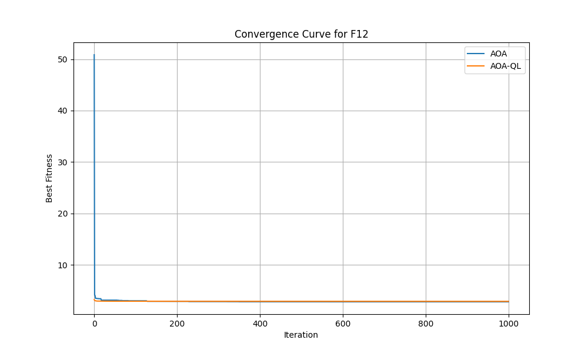 |
